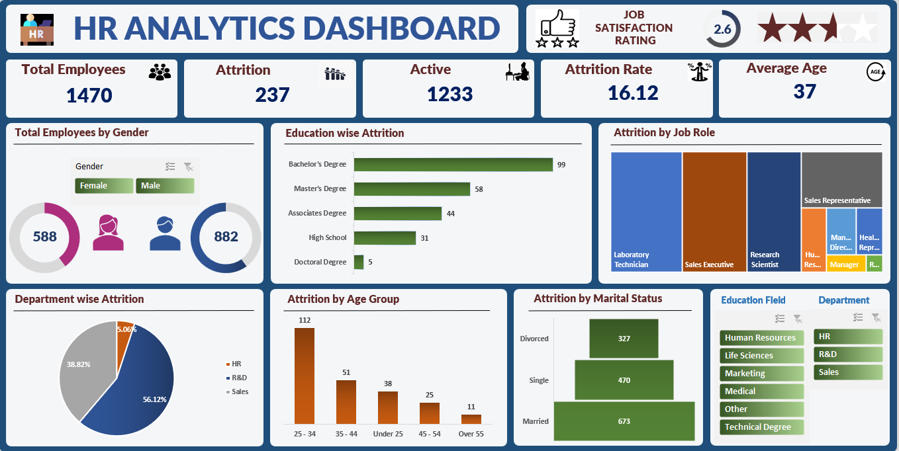
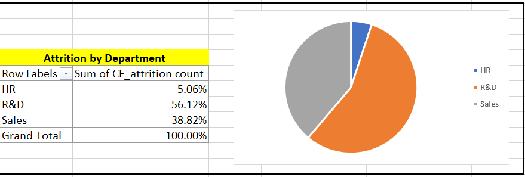
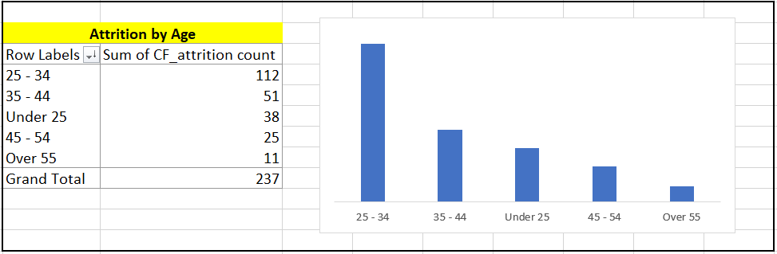
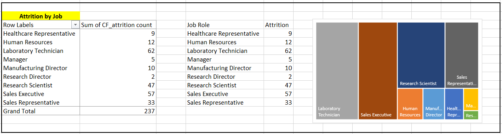

# 👥 HR Analytics Dashboard — Employee Attrition Analysis

---

## 📸 Screenshots

### Dashboard Overview

### Attrition by Department

### Attrition by Age Group

### Attrition by Job Role

> 📌 *To view the full interactive dashboard, download the Excel file and open in Microsoft Excel 2016 or later.*

---

## 📝 Description

This project delivers a full-scale **HR Analytics Dashboard** analyzing employee attrition and workforce data for a company of **1,470 employees** across 3 departments — Sales, R&D, and HR.

The goal was to identify **why employees leave**, which age groups and departments are most affected, and what factors like income, satisfaction, and overtime contribute to attrition — enabling HR teams to take data-driven retention decisions.

**What this project covers:**
- Overall attrition rate of **16.12%** — 237 out of 1,470 employees left
- Department-wise attrition with Sales showing the highest turnover
- Age group analysis — the **25–34** band has the most exits (112 employees)
- Job satisfaction average of **2.63/5** across the organization
- Gender breakdown — **882 Male, 588 Female** employees
- Attrition pattern by Education, Marital Status, and Job Role

The final output is an **interactive Excel Dashboard** with multiple analysis sheets, KPI scorecards, and Slicers that allow HR managers to drill down by department, gender, and education level.

---

## 🛠️ Tools Used

| Tool | Purpose |
|---|---|
| **Microsoft Excel** | Primary tool for entire analysis and dashboard |
| **Pivot Tables** | Attrition breakdown by dept, age, job, education |
| **Pivot Charts** | Donut, Bar, Stacked charts for visual storytelling |
| **Slicers** | Interactive filters for Department, Gender, Education |
| **KPI Cards** | Total employees, attrition count, attrition rate |
| **Conditional Formatting** | Highlight high-attrition zones |
| **Calculated Fields** | Attrition rate %, active employee count |
| **Excel Formulas** | COUNTIF, AVERAGEIF for custom HR metrics |

---

## 👤 Author

**[Raj Bhagat]**  
📧 rb161161@gmail.com  
🔗 [GitHub](https://github.com/raj07012)
